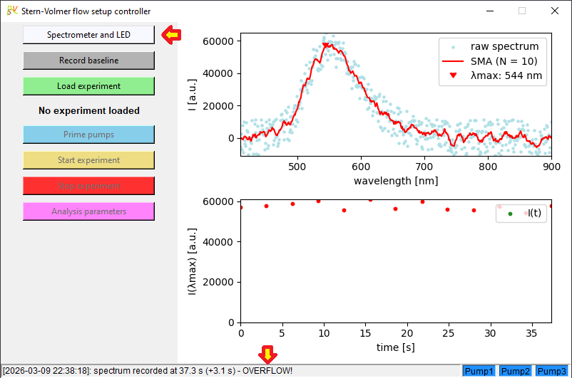
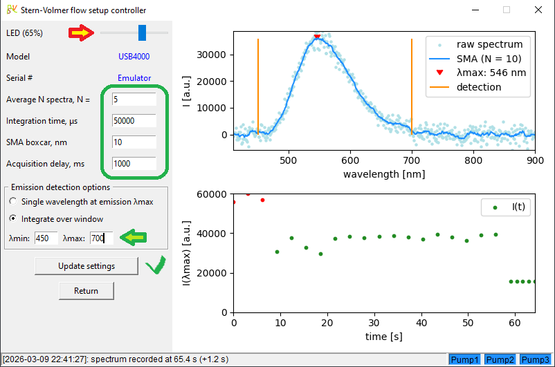
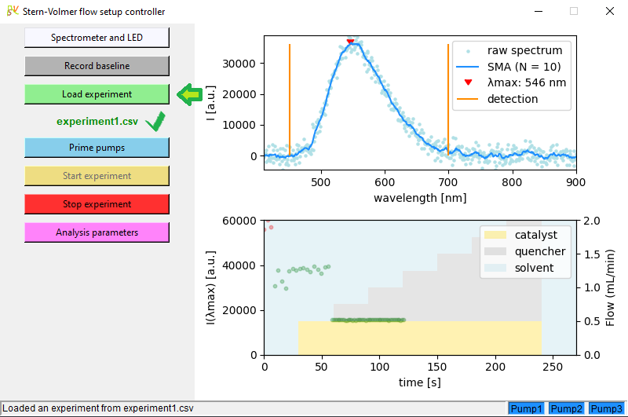
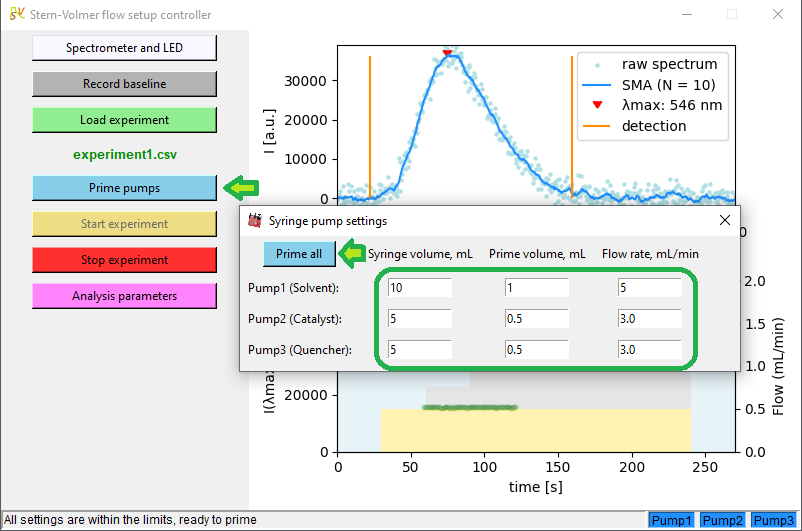
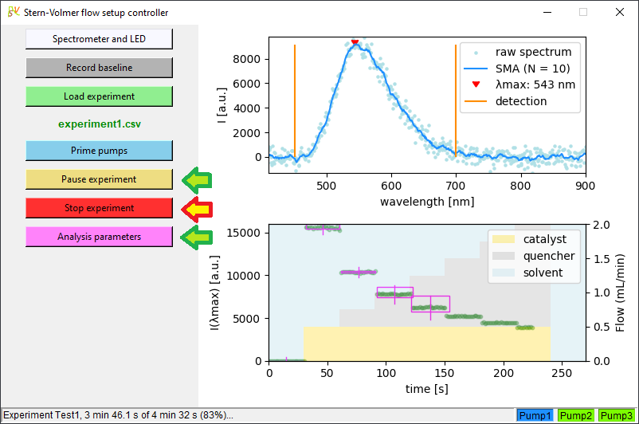
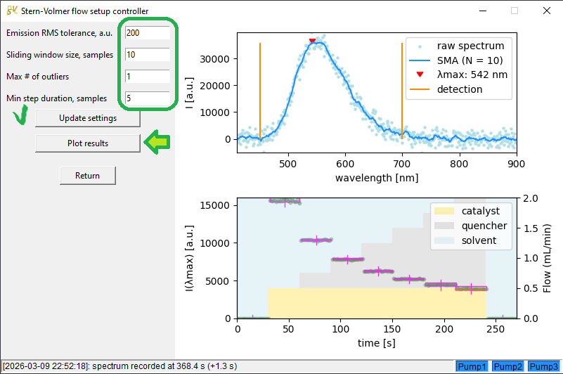
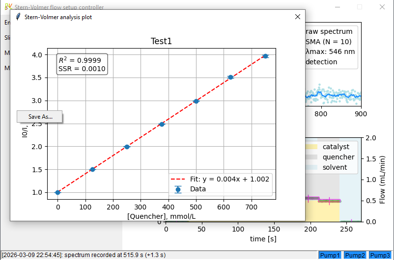

# SV Project

A cross-platform Python app controlling the in-flow Stern-Volmer analysis setup with syringe pump reagent delivery:


## 1. Project structure

```
SV-Project/
├── data/                                       Sample input files
│   ├── Demo1.csv
│   └── Mes-Acr-Me + DIPEA.csv
├── Experiment setup tool/  
│   └── Stern-Volmer experiment setup tool.htm  A helper tool (an HTML page with builtin Tailwind CSS) for creating or editing
│                                                 Stern-Volmer experiments. Required inputs: experiment name, syringe volumes,
│                                                 concentrations of photocatalyst and quencher solutions, total flow rate for
│                                                 the experiment, step duration and number of steps (0 to 20 :)).
│                                                 Pre-equilibration (priming) and rinsing of the flow cell are optional.
│                                                 The complete pumping program for the experiment is displayed and saved in a
│                                                 <experiment name>.CSV file to be used by the Stern-Volmer app
├── Lib/                                        Project modules
│   ├── __init__.py
│   ├── analysis.py                             Data processing module: step detection and noisy signal processing logic;
│   │                                             extrapolation for missing zero quencher concentration step if necessary;
│   │                                             data calculation for Stern-Volmer plot
│   ├── config.py                               App configuration file
│   ├── files.py                                File management module: reading experiment program, syringe parameters and
│   │                                             pump priming program (.CSV input); writing simple I(t) and full emission
│   │                                             spectrum over time and Stern-Volmer experiment result data (.CSV output)
│   ├── gui.py                                  GUI for the main app window (Tkinter-based)
│   ├── led.py                                  Fiber-coupled LED control module
│   ├── logger.py                               App event logging module: Python console, file (with .CSV and .HTML
│   │                                             options), UART and log window output modes (all combinable)
│   ├── ne1000.py                               NE-1000 syringe pump driver module (only one pump per UART/RS232 interface,
│   │                                             no daisy-chaining and no pumping program options): parsing pump commands
│   │                                             and responses, pump state polling
│   ├── pumps.py                                Pump management module: pump scheduler (executing and controlling real-time
│   │                                             pump actions, pausing and resuming pump program, live pump state
│   │                                             communication with GUI) and pump controller (scheduling an experiment
│   │                                             program and managing standard sequences like pump initialization, priming,
│   │                                             pump program termination and app shutdown)
│   ├── spectrometer.py                         Ocean Optics spectrometer control module: establishing connection over USB,
│   │                                             initialization, configuration by the user, recording background spectrum,
│   │                                             acquiring spectra and averaging multiple spectra per datapoint; and a basic
│   │                                             spectrometer emulator using a pre-recorded fluorescence emission spectrum
│   │                                             for rapid debugging. This module uses Seabreeze library.
│   └── uart.py                                 Serial interface management module: reading from and writing to peripheral
│                                                 devices (pumps over RS232 and fiber-coupled LED over a custom controller).
│                                                 For convenience, Raspberry Pi names (UART0 for serial logging/debugging,
│                                                 UART3-5 for pumps) are used on all platforms; UART6 is assigned to LED
│                                                 controller.
├── NE-1000 pump emulator/                      Pump emulator Qt app (tested on Windows 10,11) useful for rapid debugging.
│   │                                             Requires a com0com null-modem emulator with one pipe (COMxx <-> COMyy)
│   │                                             per running emulator copy to pose as a NE-1000 syringe pump. Only the
│   │                                             commands used by the Stern-Volmer app are implemented. To simulate the
│   │                                             syringe volume limit, run with a parameter (e.g., "NE-1000_emulator 10"
│   │                                             for a 10 mL syringe). Compiled with Qt Creator 17.0.0.
│   ├── NE-1000_emulator.pro                    
│   ├── main.cpp
│   ├── pump.cpp
│   ├── pump.h
│   ├── pump.ico
│   ├── quasiexponentialslider.cpp
│   ├── quasiexponentialslider.h
│   ├── widget.cpp
│   ├── widget.h
│   └── widget.ui
├── requirements/
│   ├── common.txt                              list of common requirements for every installation
│   ├── linux.txt                               list of requirements for installation on Raspberry Pi OS
│   └── windows.txt                             list of requirements for installation on Windows
├── Rsc/                                        Resource files (PNGs/icons etc.)
│   ├── 4CzIPN-EtOH.csv                         sample fluorescence emission spectra (4-CzIPN photocatalyst in ethanol)
│   ├── 10-oceanoptics.rules                    udev rules file for Ocean Optics spectrometers (from Seabreeze package)
│   ├── Exit.png                                icons to be used with GUI 
│   ├── Log.png
│   ├── Pump.png
│   ├── SV.png
│   └── syringes.csv                            sample syringe parameters (B. Braun Injekt® Luer Solo)
├── logs/                                       Folder to receive app log files
│   ├── .gitignore
│   └── log_2026-02-09_12-01-20.html            sample HTML log output
├── results/                                    Folder to receive app results
│   └── .gitignore
├── .gitignore                                  list of files/folders excluded from version control (venv, logs, results...)
├── Dockerfile                                  build instructions for Docker image
├── install.sh                                  bash install script (for Raspberry Pi OS)
├── install-with-docker.sh                      bash install script (for Raspberry Pi OS using Docker)
├── install.bat                                 batch install script (for Windows)
├── README.md                                   project structure, app config and usage, install and uninstall info (this file)
├── SV.py                                       main app file
├── SV-raspbian.sh                              bash script running the main app in virtual environment (for Raspberry Pi OS)
├── SV-RPi-docker.sh                            bash script running the main app in a Docker container (for Raspberry Pi OS)
├── SV-windows.bat                              batch script running the main app in virtual environment (for Windows)
├── uninstall.sh                                bash uninstall script (for Raspberry Pi OS)
├── uninstall-with-docker.sh                    bash uninstall script (for Raspberry Pi OS using Docker)
└── uninstall.bat                               batch uninstall script (for Windows)
```

## 2. Required hardware

1) An Ocean Optics fiber-coupled spectrometer (tested with USB4000 and Flame models).

2) 3x NE-1000 syringe pumps (New Era Pump Systems, Inc.). Warning: a cheaper NE-300 model does not have any computer interface exposed and is not suitable; an OEM version (NE-500, or preferably NE-501 with stall detection) should be fully compatible but was not tested.

3) A flow cuvette with a 90 degree optical path for fluorescence detection. Using a standard-size 10mm x 10mm cuvette (e.g., Hellma article Nr. 176‐751‐85‐40) for desktop spectrometers will require a cuvette holder with optical fiber adapters; consider instead a fluorescence flow cell with built-in SMA adapters like FIAlab part Nr. 79013 or Avantes Flowcell-1/4”-FL.

4) A high power fiber coupled LED with a suitable excitation wavelength, e.g. Mightex FCS-0405-000 for 405 nm (to control the LED intensity independently of the app, a manual LED driver SLA-0100-2 will also be needed). All custom controller boards listed below have built-in constant current 1 A LED driver suitable for type-A 3W high-power fiber-coupled Mightex LEDs and allow controlling LED intensity through the app. In this case, use a bare-wire terminated LED with a male connector of Delock Terminal block set for PCB (2 pin, 3.81 mm pitch; item Nr. 65952) - make sure to observe the polarity!

5) At least 2 SMA fiber patch cords to connect the optical path of the fluorescence flow cell to the LED and spectrometer; one extra fiber patch cord per inline filter if an optional filter is installed between the light source and the flow cell, or between the flow cell and the spectrometer.

6) (Optional) An inline filter (shortpass or bandpass for excitation, longpass for emission) with a fiber-coupled inline filter holder.

7) A quad (cross) mixer and suitable tubing with connectors depending on the type of syringes, mixer and flow cell or cuvette used.

8) - <ins>For Raspberry Pi OS</ins>: a) A Raspberry Pi 4B (tested on 4 Gb version) + a microSD card, at least 16 Gb but 32 or 64 Gb recommended (e.g., SanDisk High Endurance). While this setup can be used with a regular HDMI display, keyboard and mouse, for a smaller footprint we recommend using a 7" HDMI touchscreen LCD (Waveshare) with a compact on-screen keyboard (*onboard* running on X11 display server - change the settings in *raspi-config* if necessary).

   - <ins>For Windows PC</ins> (tested on Windows 10 and 11): no special prerequisites, but beware that initial installation will require admin permissions.

9) - <ins>Hardware required for Raspberry Pi version</ins>:
     - a [custom power supply/interface board](https://github.com/AlexNeckar2020/SV-hardware/tree/main/LEDdriver-RS232BoardRPi) and a 12V 2A power supply with 2.1mm or 2.5mm DC plug, or
     - a 4-port USB to DB9 RS232 serial adapter hub to enable remote control of syringe pumps from the Pi. If controlling LED intensity from the app is desired, add a [custom controller board](https://github.com/AlexNeckar2020/SV-hardware/LEDdriver-C031K6T6-Serial).

   - <ins>Hardware required for Windows version</ins>:
     - all three syringe pumps and the LED can be controlled over a single USB connection with a [custom controller board](https://github.com/AlexNeckar2020/SV-hardware/tree/main/LEDdriver-RS232Board-USBVCP), or
     - a 4-port USB to DB9 RS232 serial adapter hub to enable remote control of syringe pumps from PC. If controlling LED intensity from the app is desired, add a [custom controller board](https://github.com/AlexNeckar2020/SV-hardware/tree/main/LEDdriver-C031K6T6-Serial).

## 3. Installation

### On Raspberry Pi OS

There are several options available: 

1) <ins>Manual installation</ins>: copy this repository content into the chosen folder.\
   If *git* is installed, just clone this repository - a folder called *SV-master* will be created:
```bash
git clone https://github.com/AlexNeckar2020/SV.git
```
   Check that files *install.sh*, *SV-raspbian.sh* and *uninstall.sh* have Execute permission enabled. Then run the bash install script *install.sh* from the app folder:
```bash
cd SV-master
./install.sh
```
   Installation of all of the required components (especially the *seabreeze* library) may take time, please wait until completion. If no errors are reported, reboot the Pi.\
   The app should now be ready to run using the script *SV-raspbian.sh* or the newly created desktop shortcut.\
   The app can be uninstalled from the Pi by running *uninstall.sh*.
   
2) <ins>Using a Docker containter</ins>: First, install *Docker* on your Raspberry Pi:
```bash
curl -fsSL https://get.docker.com -o get-docker.sh
sudo sh get-docker.sh
```
   Copy this repository content into your chosen folder (assume it is called *SV*), or clone it using *git* as above.\
   Check that files *install-with-docker.sh*, *SV-RPi-docker.sh* and *uninstall-with-docker.sh* have Execute permission enabled. Then run the bash install script *install-with-docker.sh* from the app folder:
```bash
cd SV
./install-with-docker.sh
```
   Building the container image is quite slow on Raspberry Pi (with a slow SD card, up to 20 min is possible!), please wait until completion.\
   If no errors are reported, the app should now be ready to run using the script *SV-RPi-docker.sh* or the newly created desktop shortcut.\
   In case the installation is interrupted with an error message, try removing the unused containers and images and then re-run the install script:
```bash
docker system prune -a
./install-with-docker.sh
```
   The app can be uninstalled from the Docker by running *uninstall-with-docker.sh*.

3) <ins>Using an SD card image</ins>

A ready-to-use SD card image with pre-installed Raspberry Pi OS, all of required libraries and the app is available at [Zenodo](https://doi.org/10.5281/zenodo.19567545).\
Write the image to an empty SD card using Raspberry Pi Imager, Win32DiskImager or similar software and use this card as an OS disk with your Raspberry Pi 4B.\
You will need to adjust the region, language, LAN and WiFi settings according to your preferences.
   
### On Windows

Copy this repository content into the chosen folder. If *git* is installed, just clone this repository - a folder called *SV* will be created:
```bash
git clone https://github.com/AlexNeckar2020/SV.git
```
   Then run the install script *install.bat* from the app folder:
```bash
cd SV
install.bat
```
   The script will check if the expected version of Python (currently, 3.12) is not present on your machine and will attempt to install it (or failing that, will ask you to install manually).\
   If Python installation was necessary, run *install.bat* again and wait until completion. If no errors are reported, the app should now be ready to run using *SV-windows.bat*.\
   The script *uninstall.bat* will simply remove the virtual environment (.venv folder) and clear pip package cache, leaving all installed Python versions in place.

## 4. Hardware setup

###  On Windows

1) before connecting an Ocean Optics spectrometer to your PC, install the original drivers ([OmniDriver 2.80](https://www.oceanoptics.com/software/resources/discontinued-software/)) - this will require administrator permissions. If the spectrometer had been connected *before* the Ocean Optics drivers were installed, uninstall the driver assigned to it by Windows and repeat this step. 

2) to connect three NE-1000 pumps, use either:
   - a [custom controller board](https://github.com/AlexNeckar2020/SV-hardware/tree/main/LEDdriver-RS232Board-USBVCP) (LEDdriver-RS232Board-USBVCP) with regular RJ11 6P4C or 6P6C telephone cables, or
   - a 4-port USB to DB9 RS232 serial adapter hub (e.g., [StarTech ICUSB2324I](https://www.startech.com/en-de/cards-adapters/icusb2324i)) and adapter cables ([CBL-PC-PUMP-7](https://www.syringepump.com/accessories.php#primarycable)).

4) to control the intensity of a fiber-coupled LED via the app, connect it as follows:
   - if the hub is used to connect the pumps, connect the fourth RS232 port of the hub using a regular straight-through (PC to device) cable to another [custom controller board](https://github.com/AlexNeckar2020/SV-hardware/tree/main/LEDdriver-C031K6T6-Serial) (LEDdriver-C031K6T6-Serial). Connect the LED to the controller board;
   - if the pumps are controlled by the [custom controller board](https://github.com/AlexNeckar2020/SV-hardware/tree/main/LEDdriver-RS232Board-USBVCP) (LEDdriver-RS232Board-USBVCP), also connect the LED to it.

Otherwise, LED intensity could be controlled manually using a constant current driver, e.g. [SLA-1000-2 from Mightex](https://www.mightexsystems.com/product/sla-series-two-channel-led-drivers-with-manual-and-analog-input-controls/) and must remain unchanged between replicate experiments.

###  On Raspberry Pi

Connect a [custom power supply/interface board](https://github.com/AlexNeckar2020/SV-hardware/tree/main/LEDdriver-RS232BoardRPi) (LEDdriver-RS232BoardRPi) to the GPIO connector using a Raspberry Pi 40 pin GPIO cable (e.g., https://www.berrybase.de/en/gpio-kabel-fuer-raspberry-pi-40-pin-grau). Connect three NE-1000 pumps (with regular RJ11 6P4C or 6P6C telephone cables), a fiber-coupled LED and a 12V 2A power supply to the board.\
Alternatively, you can connect a 4-port USB to DB9 RS232 serial adapter hub (e.g., [StarTech ICUSB2324I](https://www.startech.com/en-de/cards-adapters/icusb2324i)) to one of the USB ports of the Pi and connect the syringe pumps to it using adapter cables ([CBL-PC-PUMP-7](https://www.syringepump.com/accessories.php#primarycable)). In this case, LED intensity can be controlled manually, or LED can be connected through a [custom controller board](https://github.com/AlexNeckar2020/SV-hardware/tree/main/LEDdriver-C031K6T6-Serial) (LEDdriver-C031K6T6-Serial) to the remaining fourth RS232 port of the hub using a regular straight-through (PC to device) cable.\
Connect an Ocean Optics spectrometer to one of the USB ports of Raspberry Pi.

## 4. Configuration

Open *Lib/config.py* file and edit the following configuration parameters:

a) on **Windows**:\
   - line 9:
```python
   PLATFORM = PLATFORM_MS_WINDOWS
```
   - lines 30,31:
```python
   HARDWARE_INTERFACE = {"LED": LED_OVER_SERIAL,
                         "PUMPS": PUMPS_OVER_SERIAL}
```
   Choose LED_OVER_SERIAL if LED intensity is controlled via the app, otherwise LED_MANUAL_ONLY. 
   
   - lines 102-111:
```python
       UART_DEVICES = {  # for Windows on PC, UART devices communicate over COM ports with names "COMxx" or "\Device\yyyyy"
                      # use command "chgport" or "mode" to retrieve this information
                      # Here is a sample configuration using a USB to 4x RS232 bridge (StarTech.com ICUSB2324I) for 3x pumps and LED:
                      # Windows driver assigns the first available COM port numbers to the bridge, COM5-COM8 in this example:
                      # COM90 <-> COM80 pipe is configured in null-modem emulator (com0com), so that all debug UART traffic can be read at COM80
                      "UART0": { "device": "COM90", "name": "Serial/Debug"},
                      "UART3": { "device": "COM7", "name": "Pump1 (Solvent)"},
                      "UART4": { "device": "COM9", "name": "Pump2 (Catalyst)"},
                      "UART5": { "device": "COM10", "name": "Pump3 (Quencher)"},
                      "UART6": { "device": "COM8", "name": "LED serial controller"}
```
   Replace the COM port numbers with the values from your system. Ignore "UART0" if you are not planning to use the serial interface for logging, otherwise enter the COM port number corresponding to your configuration.

b) on **Raspberry Pi**:\
   - line 9:
```python
   PLATFORM = PLATFORM_RASPBERRY_PI
```
   
   - lines 31,32:\
   if a [custom power supply/interface board](https://github.com/AlexNeckar2020/SV-hardware/tree/main/LEDdriver-RS232BoardRPi) (LEDdriver-RS232BoardRPi) is used:
```python
   HARDWARE_INTERFACE = {"LED": LED_OVER_RPI_GPIO,
                         "PUMPS": PUMPS_OVER_RPI_UARTS}
```
   otherwise, if a USB to RS232 hub is used:
```python
   HARDWARE_INTERFACE = {"LED": LED_OVER_SERIAL,
                         "PUMPS": PUMPS_OVER_SERIAL}
```   
   Use LED_MANUAL_ONLY if LED intensity will not be controlled via the app.

   - lines 95-100:\
   leave unchanged if the custom power supply/interface board is used. If a USB to RS232 hub is used, update as follows:
```python
    UART_DEVICES = {  # GPIO configuration for Raspberry Pi 4B:
                        "UART0": { "device": "/dev/ttyS0", "name": "Serial/Debug"},     # UART0: RX on pin 10 (GPIO16), TX on pin 8 (GPIO15) (/dev/serial0 is alias for /dev/ttyS0 or /dev/ttyAMA0)
                        "UART3": { "device": "/dev/ttyUSB0", "name": "Pump1 (Solvent)"},   # UART3: port 1 of USB to RS232 hub
                        "UART4": { "device": "/dev/ttyUSB1", "name": "Pump2 (Catalyst)"},  # UART4: port 2 of USB to RS232 hub
                        "UART5": { "device": "/dev/ttyUSB2", "name": "Pump3 (Quencher)"},  # UART5: port 3 of USB to RS232 hub
                        "UART6": { "device": "/dev/ttyUSB3", "name": "LED serial controller"}   # UART6: port 4 of USB to RS232 hub
                   }
```
   
You're all set! Start the main app. Ensure that all pumps are properly communicating (panels Pump1, Pump2, Pump3 are 🟦blue and not ⬛gray or 🟥red), the spectrometer is connected (no "Please connect Ocean Optics spectrometer..." message remains in the status bar) and the LED intensity can be adjusted with the slider from the "Spectrometer and LED" tab and by rotating the knob of the controller (unless LED_MANUAL_ONLY option was selected).

## 5. Using the software

Start by pressing the "Spectrometer and LED" button in the main menu:\


Adjust the LED intensity using the slider (red arrow; if disabled, LED intensity can only be controlled manually with the LED driver) so that there is no "OVERFLOW" indication.\
Adjust the spectrum recording parameters (green box) so that the averaged spectrum (SMA, blue line) looks sufficiently smooth and stable. The time required to record a single datapoint is at least N * integration time(us) + acquisition delay(ms). The emission intensity can be recorded at the emission maximum (red triangle, default setting) or integrated over the entire emission peak (with the detection window set manually, green arrow):\


Press "Update settings" for the settings to take effect and "Return" to return to the main menu.\
Press "Load experiment" button (green arrow) to load an experiment created with the *Stern-Volmer experiment setup tool* or from the modified sample *experimentX.csv* files in the /data folder:\


If successful, pump program will be displayed and the loaded experiment file name will be shown (green tick mark).\
To prime the syringe pump tubing, mixer and the flow cell, press "Prime pumps" button (green arrow): 


The pump priming program is dependent on syringe volumes and will be imported from the experiment file. It can be adjusted manually (values in green box): to skip an individual pump, set the corresponding prime volume to zero (values outside of the permitted range are marked red). Press "Prime all" to complete the priming. The "Start experiment" button is now enabled.\
Start the experiment:\


It can be paused and resumed anytime by pressing the button "Pause experiment/Resume experiment" (green arrow), or interrupted by pressing "Stop experiment" (red arrow).\
During or after the run, adjust the analysis parameters (button "Analysis parameters" opens the settings panel) so that the maximum possible number of steps are identified for the analysis:\


Press "Update settings" (green tick mark) for the modified settings (green box) to apply. Once the step detection is satisfactory and the experiment has finished, press "Plot results" (green arrow) to display the Stern-Volmer plot. The results are saved automatically in the /Results folder as .CSV files with the experiment name and timestamp once the experiment is complete. Right-clicking the plot allows saving it as an image:\


NB: Ensure that the emission intensity of unquenched catalyst does not exceed the linear response range of the spectrometer (otherwise, the spectrum and the individual out-of-range intensity datapoints are plotted red) and lower the LED intensity if needed. A single out-of-range datapoint at zero quencher concentration can be corrected by the software, but it will affect the analysis precision.

